<div align="center">

<!-- Hero Banner -->


<br/>

<!-- Typing Headline -->
<a href="https://heylalit.tech/">
  
</a>

<br/><br/>

<!-- Social & Portfolio Badges -->
<a href="https://heylalit.tech/"></a>
<a href="https://www.linkedin.com/in/lalitnamdev/"></a>
<a href="https://x.com/lalitnamdev_"></a>
<a href="mailto:namdevlalit914@gmail.com"></a>
<a href="https://github.com/codebylalit"></a>

<br/><br/><br/>

<!-- ANIMATED TERMINAL SUITE -->
<h3><code>codebylalit@github ~ $ ./contributions.sh</code></h3>


<br/><br/>

<h3><code>codebylalit@github ~ $ whoami</code></h3>
<table>
  <tr>
    <td valign="top" align="center"></td>
    <td valign="top" align="center"></td>
  </tr>
</table>

</div>

---

## ⚡ About Me

```typescript
interface DeveloperProfile {
  name: string;
  role: string;
  location: string;
  coreStack: string[];
  productFocus: string[];
  learning: string[];
  currentStatus: string;
}

const lalit: DeveloperProfile = {
  name: "Lalit Namdev",
  role: "Frontend Engineer & Micro-SaaS Builder",
  location: "Ahmedabad, India 🇮🇳",
  coreStack: ["React", "React Native", "TypeScript", "Next.js", "Tailwind CSS"],
  productFocus: [
    "AI-powered web & mobile applications",
    "Micro-SaaS products from 0 to 1",
    "Performant frontend architecture & smooth micro-interactions"
  ],
  learning: ["Cloudflare Workers & D1", "System Design", "Shaders & Canvas"],
  currentStatus: "🚀 Open for freelance engineering, high-impact contracts & product collabs"
};
```

---

## ✨ Featured Micro-SaaS & Product Bento

<table>
<tr>
<td width="50%" valign="top">

### 🛵 Skooty & SkootyGO
> **Real-time Mobility & Ride-Hailing Platform**
- ⚡ Mobile-first user experience with live GPS tracking
- 🛠️ **Tech**: React Native, TypeScript, WebSockets, Node.js

</td>
<td width="50%" valign="top">

### 🧾 Invoicelly
> **AI Invoicing & Invoice Generation Engine**
- ⚡ Turns natural language prompts into polished PDF invoices
- 🛠️ **Tech**: React, Next.js, AI Prompts, Tailwind CSS

</td>
</tr>
<tr>
<td width="50%" valign="top">

### 🍌 NenoBanana
> **Web-Based AI Visual Generator**
- ⚡ Instant image synthesis powered by Google Gemini API
- 🛠️ **Tech**: Vue / React, Gemini AI API, Serverless Edge

</td>
<td width="50%" valign="top">

### 🔖 Hashly
> **AI Mobile Content & Hashtag Generator**
- ⚡ Smart captioning, hashtag recommendations & meme creation
- 🛠️ **Tech**: React Native, Expo, OpenAI / Gemini API

</td>
</tr>
</table>

---

## 🛠️ Tech Stack & Arsenal

<div align="center">

#### Frontend & Core UI


<br/>

#### Backend, Cloud & Database


<br/>

#### Tools & Design


</div>

---

## 📊 Live GitHub Pulse & Activity

<div align="center">


</div>

---

## 🏆 Honors & Highlights

- 🏅 **Top 50 Finalist** — *Odoo x Amalthea Hackathon, IIT Gandhinagar*
- ☁️ **Google Cloud Arcade Participant**
- 🚀 **Shipped multiple AI Micro-SaaS tools** loved by real users

---

## 🌐 Connect & Collaborate

<div align="center">

<a href="https://heylalit.tech/"></a>
<a href="https://www.linkedin.com/in/lalitnamdev/"></a>
<a href="https://x.com/lalitnamdev_"></a>
<a href="mailto:namdevlalit914@gmail.com"></a>

<br/><br/>


</div>
